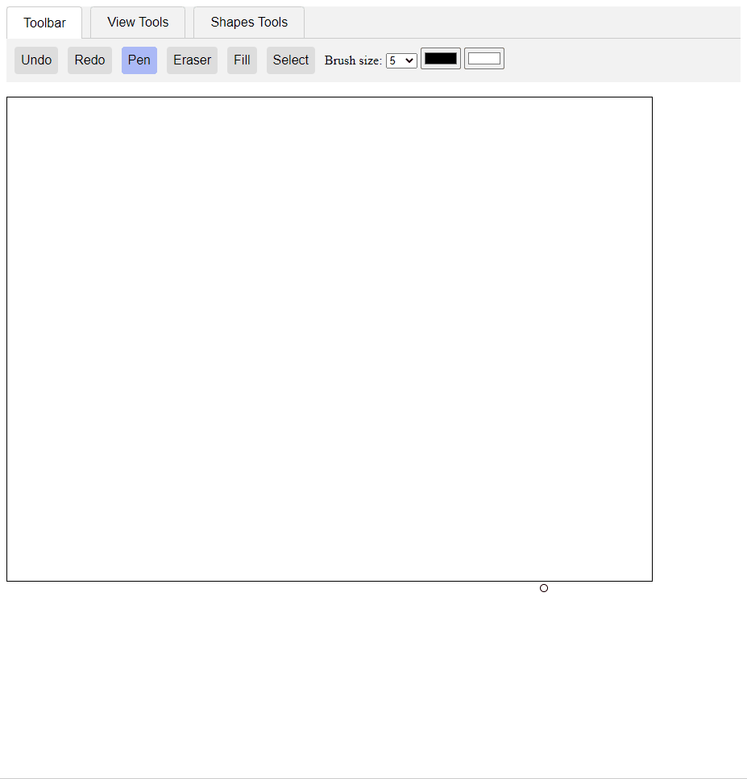

# A ChatGPT adventure to create a MS Paint clone

I tried to write a MSPaint clone on browser with the help of the ChatGPT.  
I tried to copy&paste the suggestions of ChatGPT, if it's possible. The result is outstanding.

The whole chat can be found at
[https://chat.openai.com/share/febc7000-d61c-4bfc-8cd1-01d086188afe](https://chat.openai.com/share/febc7000-d61c-4bfc-8cd1-01d086188afe)

Here is the demo of the application



## What's next?

Let's ask it to ChatGPT.

The input:

```text
We wrote a mspaint clone on browser. This is the file structure. Could you suggest some new features to improve it.
PAINTAPP
│   index.html
│   Readme.md
│   script.js
│
├───assets
│   ├───docs
│   │       PaintAppTest.gif
│   │
│   └───toolbar-actions
│       ├───eraser
│       │   └───images
│       │           cursor-icon.png
│       │
│       ├───fill
│       │   └───images
│       │           cursor-icon.png
│       │
│       ├───pen
│       │   └───images
│       │           cursor-icon.png
│       │
│       └───select
│           └───images
│                   cursor-icon.png
│
├───DrawigTools
└───paint-app
    │   paint-app.js
    │
    ├───extensions
    │   │   brush-size-indicator.js
    │   │   drawing-area-extension.js
    │   │   toolbar-extension.js
    │   │
    │   ├───drawing-tools
    │   │   │   eraser-drawing-tool-extension.js
    │   │   │   fill-drawing-tool-extension.js
    │   │   │   pen-drawing-tool-extension.js
    │   │   │   select-drawing-tool-extension.js
    │   │   │
    │   │   └───shapes
    │   │           star-shape-drawing-tool-extension.js
    │   │
    │   ├───toolbar
    │   │       copy-selection-button-extension.js
    │   │       cut-selection-button-extension.js
    │   │       redo-button-extension.js
    │   │       toolbar-button-extension.js
    │   │       undo-button-extension.js
    │   │       zoom-in-button-extension.js
    │   │       zoom-out-button-extension.js
    │   │       zoom-reset-button-extension.js
    │   │
    │   └───widgets
    │           ui-value-binder.js
    │           ui-value-viewer.js
    │
    └───features
            undo-redo-manager.js

```

That's great that you've developed an MSPaint clone on the browser! Here are some suggestions for new features to improve it:

1. Layers: Implement a layer system that allows users to work on different layers independently. This will enable them to manage complex drawings more effectively.

1. Text Tool: Add a text tool that allows users to add text to their drawings. They should be able to customize the font, size, color, and position of the text.

1. Shape Tool Enhancements: Enhance the shape tool by adding more shape options such as rectangles, circles, triangles, and polygons. Provide options to customize the fill and stroke color, as well as the stroke width.

1. Image Import: Allow users to import images from their devices or from URLs directly into the drawing canvas. This feature can expand the creative possibilities and enable users to incorporate external elements into their artwork.

1. Custom Brushes: Provide the ability to create custom brushes with different shapes and textures. Users can define their own brush patterns or import them from external files.

1. Filters and Effects: Implement various filters and effects such as blur, sharpen, color adjustments, and artistic effects. These can help users enhance their drawings and add unique visual styles.

1. Layers and Selection Manipulation: Enable users to manipulate selected portions of the drawing, such as scaling, rotating, and flipping. Additionally, provide options to merge or arrange layers to modify the drawing hierarchy.

1. Social Sharing: Integrate social media sharing capabilities, allowing users to share their creations directly from the application. This can encourage users to showcase their artwork and engage with a broader community.

1. History Panel: Add a history panel that displays a list of previous actions, enabling users to jump back to a specific point in their drawing process. This feature is useful for non-destructive editing and experimentation.

1. Keyboard Shortcuts: Implement keyboard shortcuts for common actions, providing users with a more efficient and intuitive way to interact with the application.

Remember to prioritize features based on your target audience and the goals of your application.
